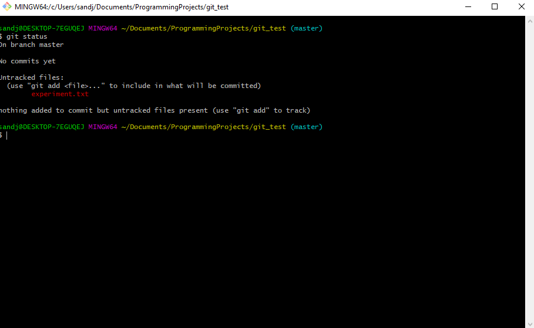

# Git

Git is, "a distributed version-control system for tracking changes in source code during software development." It is used to better organize changes made to a large code base shared by many people, just like our robot code.
Git can take a while to get the hang of. Thankfully, you only need to know a few essential functions to get started with the robot code. If you'd rather learn from a person who knows what they're talking about, explore the following [YouTube playlist](https://www.youtube.com/playlist?list=PLRqwX-V7Uu6ZF9C0YMKuns9sLDzK6zoiV) which will teach you Git basics without even coding.

## Installation

### Preliminary Info & Operating Systems
Only complete these installation steps if you plan on writing and contributing code from you own machine. If you only use the school machines (will most likely be impossible 2020), or edit through GitHub (not recommended), you do not need to follow these steps.
This section will be written from the point of view of a Windows user, as we currently do not have access to Mac machines. There are most likely many online resources you can use to find out how to install Git on macOS. Git cannot be installed on a school Chromebook.

### Installing
Go to [https://git-scm.com/download/win](https://git-scm.com/download/win), which will begin downloading the Windows Git installer.

### Setps & Options
:exclamation:*Note: many of these steps are general recommendations. If you are an advanced user or programmer, feel free to change some of these steps. Just note that your experience may be slightly different and we may not be able to help completely. An asterisk (\*) will be placed next to mandatory steps.*

- Leave the install location to the default spot.
- Leave the selected components to default. You may add a desktop icon if you wish.
- Leave the start menu folder at default.
- Set the default text editor to Visual Studio Code (or your editor of choice)*
- Select the middle option, "Git from the command line and also from 3rd-party software"*
- Leave the default option "Use the OpenSSL library"
- Leave the line ending conversions to the default option
- Select the default option ("Use MinTTY")
- Leave the extra options on default
- Do not add experimental options

You are now done! You can launch git bash through the start menu (Windows search bar) or the desktop icon if you added it.

## Basic Command Prompt Navigation

When opened, your git bash terminal should look roughly like this:

In green, it should say your desktop's name/ID

The command line is essentially just the File Browser in text form. Just like you can click to go to different folders, you can enter different folders here. Use the **ls** (list) command to list all of the files and directories (folders) from your current directory (folder).

Yours should look similar but not the same.

Every item with a / at the end means it is a folder, or directory. If it does not have the /, it is a file.

Let's navigate to the Desktop folder. Because Windows is stupid, my desktop folder is hidden inside of my OneDrive folder. You can verify/discover this by using Window's own file browser and finding the path to your files and folders through that (slower, but easier for newcomers).

To enter another folder, simply use the **cd** (change directory) command.

You can tell you've entered the directory when the yellow text above the $ changes from "~" to "~/FOLDERNAME" (not actually FOLDERNAME, just the name of the folder you cd into). This yellow text gives you the path of your current working directory, or in other words, the directories you needed to enter in order to get where you are now. The single "~" simply indicates the root directory.
To get to the Desktop directory, we can simply cd into it like so. I used ls here to verify that Desktop was inside of OneDrive directory.

Here, you can store your code and projects. You can also follow these steps to find a project in any other directory, such as Documents.

## Git Basics

:information_source:*Robotics. You can create an account, for free, [here](https://github.com/). You will most likely be asked to sign into a GitHub account when working with Git and pushing to GitHub, so remember your login credentials.*

### Creating a New Repository

Git works by managing repositories of code. These repositories are simply collections or projects of code that have a history of edits and branches associated with them.
Once you create your directory for your code, you can initialize a git repository there. (If you import an existing project from GitHub, this step may be completed for you.) Simply use the git init command.

As you can see, there will be a message telling you the success/failure of the command. You also know it works by the blue (master) in the top line, next to the path. This word will tell you what branch you are currently on. We will go into more depth on branches later, but just know that master (also called main) is the main branch of code.

### Connecting to GitHub

GitHub at its core hosts Git repositories on the open Web. In fact, this tutorial itself is a Git repository stored on GitHub. This is extremely useful, as you can work on changes on you local machine, push them to the cloud when you're ready, and have your teammate pull those changes back down to their local machine. If either of you mess up on local code, nothing on the cloud is harmed.

Once you've created a repository (see the GitHub page if you do not know how), you can connect simply from the URL of the repository page. Use the "git remote add origin" command, followed by the URL of the repository page. As an example,

Now, you can push any changes to GitHub. We will go over how to do this in the later sections.

### Committing Changes

Git works, at its most fundamental level, by tracking changes to a file. These changes, when "pushed" to a branch, affect the master version of the repository. Before they are committed, they do not change the repository Git has as the master version. This allows you to roll back any unwanted changes so that they do not affect the main repository. This is extremely useful as you can roll back any harmful changes or mistakes you make without affecting other versions or copies.

In the git_test repository from the example above, create a text file to experiment with.

In this image, we create a text file using the **touch** command followed by the file name & type.

Next, use Notepad or any other text editor to make a change to the text file. We will be using Visual Studio Code. (VS Code has Git integration by default, which you can explore in its section).

Before we can commit our changes, we need to stage them. To stage all of the changes you have made to files, use the **git add** command followed by a **.** to indicate all files. 
Before you do this, use the **git status** command to see what it does. It will display all of the untracked files (files that you have changed but not staged) and all of your uncommitted changes. 

As an example, yours should look similar to this:

Once you **git add .**, run **git status** again to see what it says.

As you can see, it no longer warns us about untracked files, but now informs us about uncommitted files. This is because our files have been staged, meaning they are ready to be committed, but they have not actually been committed yet. Git also has a message if you want to unstage any files you accidently added.

To finally commit our changes, use the git commit command. You should always include a "commit message" when you commit changes, so that other programmers know what changes you made to the code. Do this by including a -m flag, followed by your message in quotation marks. As an example:

Git will give you a message with the status of your commit, and some data about it. You can further verify the commit worked by running git status again.

:information_source:*Commit messages should be very short! Keep them to one sentence, and only describe the changes you have made. It's very easy to be lazy or too detailed with these messages: don't fall into that trap!*
------
:information_source:*When making commits, it's a good idea to save your credentials with Git so that others know who makes which changes. To do this, copy and paste the command*
**git config --global user.name "NAME"**
*replacing NAME with your name. Also paste the command*
**git config --global user.email "EMAIL"**
*replacing EMAIL with your email.*